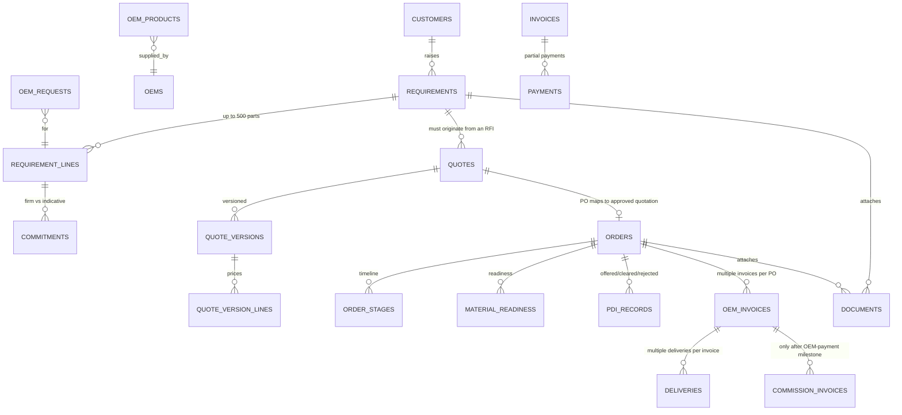

# DATA-MAP — the client's Odoo modules → screens → database

**Source read:** `Inverbrass Odoo Order Management sheet (1).xlsx.ods` (verified byte-identical in
content to `_extracted/Ram Prasad Assets/Inverbrass Odoo Order Management sheet (1).xlsx`). Sheets:
`Sheet1` (lifecycle), `Master Data Inputs`, `Input Sheet` (the authoritative module + field spec,
rows 3–172), `Dashboard requirements`.
**Prepared:** 2026-10-05. Read with `docs/RELEASE-SCOPE.md`.

---

## 0. Why the menu does not show Orders, Payments or Leads

The menu is **Today · Requirements · OEMs · Quotes · Documents · Style guide**. Orders, PDI,
Delivery, Payments, Commission and Reports are absent **by decision, not by omission** —
`docs/RELEASE-SCOPE.md` §2 cuts them to Phase Two because they need the database and auth that this
session did not hold (see §6 there). They are not half-built and there is no greyed-out button for
them.

**"Leads" is not a module in the client's own sheet.** The lead *is* the RFI / Tender Enquiry. In
this app that is the `requirements` screen; a received/qualifying requirement is the lead. Adding a
separate Leads module would duplicate the anchor entity the brief says everything hangs off, so I
recommend against it — use the `Requirements` list filtered by status instead. (If the client uses
the word "lead" for a pre-RFI scrap, that is a new entity the brief does not mention and needs a
decision before it is built.)

The rest of this document answers "where do the missing modules really fit, and how are they mapped
to the database?"

---

## 1. The nine transaction modules

| # | Odoo module (Input Sheet) | What it is | Screen it belongs on | Phase |
|---|---|---|---|---|
| 1 | RFI / Tender Enquiry | The incoming requirement (the lead) | **Requirements** (exists) | Now |
| 2 | Quotation | Quotes from an RFI, versioned | **Quotes** (exists, display) | Now |
| 3 | Purchase Order (PO) | Client PO against an approved quote | **Orders** (to add) | Two |
| 4 | Material Readiness | OEM production/QC before inspection | **Orders → readiness tab** (to add) | Two |
| 5 | PDI / Inspection | Offered / cleared / rejected inspection | **Orders → PDI tab** (to add) | Two |
| 6 | OEM Invoice to Client | Invoice after approved PDI | **Payments** (to add) | Two |
| 7 | Delivery | Dispatch, GRN, POD, acceptance | **Orders → delivery tab** (to add) | Two |
| 8 | Payment Tracking | Client→OEM payments, partial, aging | **Payments** (to add) | Two |
| 9 | Supreme Q Commission Invoice | Commission invoiced after OEM-payment milestone | **Payments → commission tab** (to add) | Two |

## 2. Master data modules

| Odoo master | Fields (from `Master Data Inputs`) | Screen | Table | Status |
|---|---|---|---|---|
| Customer Master | name, division, sub-division, contacts, email, phone, billing/delivery address, GST, GeM reg, vendor reg, portal login, payment terms, approval requirements | **Requirements** customer picker; a **Customers** master later | `customers`, `customer_contacts` | **new** (today `requirements.customer` is free text) |
| OEM Master | name, brand/category, country of origin, contacts, portfolio, MOQ rules, lead time, pricing validity, freight/warranty/payment terms, commission %, NDA status, certification expiry, bank details | **OEMs** (exists) | `oems` (+ columns below) | partial — many columns missing |
| Product / Part Master | part no (client & OEM), description, HSN, OEM mapping, UoM, category, specs, compliance certs (RCMA/CEMILAC/DGQA/LCSO/MIL), lead time, MOQ, shelf life, export restriction, standard price, currency | **OEMs → products** (exists, thin) | `oem_products` + new `products` | partial |
| Competitor Data | competitor list | not built (PRD excludes a competitor DB; only *competitor preference* as a loss reason) | — | excluded by decision |

## 3. The relation chain (what the client means by "how those are related")

Business rules the sheet states, which the schema must make structural:

- Every quotation must originate from an RFI → `quotes.requirement_id NOT NULL` (already enforced).
- Every PO must map to an approved quotation → `orders.quote_id` + a constraint that the quote is
  `approved` (the "no orphan PO" rule).
- Multiple invoices per PO; multiple deliveries per invoice → 1:m, 1:m (schema shape).
- Commission invoice only after the OEM-payment milestone → `commission_invoices.oem_invoice_id` +
  trigger that requires a matching payment.
- Partial deliveries and partial payments → balances computed, not stored.
- Complete audit trail → triggers already defined in `0003_audit.sql`.

## 4. Field-level mapping, module by module

Legend: **table.column** = target; *(have)* exists in `supabase/migrations/0001`; *(new)* added in
`0005_extended_modules.sql`.

### 4.1 RFI / Tender Enquiry → `requirements` + `requirement_lines` (screen: Requirements, now)

| Sheet field | Maps to | Status |
|---|---|---|
| Project Name | `requirements.project_name` | new |
| Customer Name (Name/Division/Sub) | `requirements.customer_id` → `customers` (fallback text) | new |
| OEM Name | `requirement_lines.oem_id` (shortlist link) | new |
| Part Description / Part Number (up to 500) | `requirement_lines.description` / `.part_number` + `.client_part_number` | have (client part no new) |
| Quantity | `requirement_lines.quantity` | have |
| Delivery Requirement (per part) | `requirement_lines.deadline` | have |
| Bid Type (Single/Double) | `requirements.bid_type` | new |
| Submission Type (Hard/Soft/Both) | `requirements.submission_type` | new |
| Source of Enquiry (GeM/Portal/Direct/OEM) | `requirements.source` | new |
| GeM Tender Number | `requirements.gem_tender_no` | new |
| Due Date for Quotation | `requirements.submission_deadline` | have |
| Quotation Validity Requirement | `requirements.quotation_validity_days` | new |
| Staggered Delivery (Y/N) | `requirement_lines.staggered` | new |
| Approval Requirements (RCMA/CEMILAC/…) | `requirement_lines.approval_requirements text[]` | new |
| Assigned Employee | `requirements.assigned_to` | new |
| Status (Open/Under Review/Submitted/Lost/Won/Pass) | `requirements.status` (mapped, see §5) | have |
| If Pass, Regret Letter date | `requirements.regret_letter_date` | new |
| If Lost → Competitor Detail | `requirements.loss_reason` + `requirements.competitor_note` | have + new |
| Remarks | `requirements.notes` | have |
| Attachments (RFQ, tender docs, drawings, specs, internal notes) | `documents` rows (`owner_type='requirement'`) | have |

### 4.2 Quotation → `quotes`, `quote_versions`, `quote_version_lines` (screen: Quotes, now)

| Sheet field | Maps to | Status |
|---|---|---|
| Quotation Number | `quotes.quote_no` | new |
| Linked RFI Number | `quotes.requirement_id` | have |
| Date | `quotes.created_at` / `quote_versions.created_at` | have |
| Customer / OEM Name | via requirement / `quote_version_lines.oem_id` | have (oem_id new on line) |
| Part Number / Description / Quantity | `quote_version_lines.requirement_line_id` → line | have |
| Unit Price | `quote_version_lines.oem_price`, `.final_price` | have |
| Currency (INR/USD/EUR) | `quote_version_lines.currency` | new (A15 says INR-only v1) |
| Freight Charges / Taxes | `quote_version_lines.freight`, `.taxes` | new |
| Delivery Terms (Ex-works/CIF/FOB) | `quote_version_lines.delivery_terms` | new |
| Lead Time | `quote_version_lines.lead_time_days` | have |
| Payment Terms | `quote_version_lines.payment_terms` | new |
| Validity of Quotation | `quote_versions.valid_until` | new |
| Discount Offered | `quote_version_lines.discount` | new |
| PNC Status | `quote_version_lines.pnc_status` | new |
| Technical / Commercial Compliance | `quote_version_lines.tech_compliant`, `.comm_compliant` | new |
| Submission Status | `quote_versions.status` | have |
| Version Number | `quote_versions.version_no` | have |
| Attachment (final PDF) | `documents` (`owner_type='quote'`) | new owner_type |
| Remarks | `quote_versions.notes` | new |

### 4.3 Purchase Order → `orders` (screen: Orders, Phase Two)

| Sheet field | Maps to | Status |
|---|---|---|
| PO Number / PO Date | `orders.po_number`, `.po_date` | new (today `orders.po_ref`) |
| Linked Quotation | `orders.quote_id` | have |
| Customer / OEM / Part | via requirement / lines | have |
| Quantity Ordered / Unit Price / PO Value | `order_lines` (new) | new |
| Taxes | `orders.taxes` | new |
| Delivery Schedule | `order_lines.delivery_schedule` | new |
| Partial Delivery Allowed | `orders.partial_allowed` | new |
| PDI Required / Mode | `orders.pdi_required`, `.pdi_mode` | new |
| PDI Inspector (OEM + client) | `orders.pdi_inspector_oem`, `.pdi_inspector_client` | new |
| Documentation Required / Special Conditions | `orders.docs_required`, `.special_conditions` | new |
| Warranty Terms / Payment Terms | `orders.warranty_terms`, `.payment_terms` | new |
| Status (Open/Processing/Completed) | `orders.status` | new |
| Attachment (PO copy) | `documents` (`owner_type='order'`) | have |

### 4.4 Material Readiness → `material_readiness` (screen: Orders → readiness, Phase Two) *(all new)*

`id`, `order_id`, `oem_id`, `part_number`, `quantity_ready`, `manufacturing_status`
(In Production/Ready), `internal_qc_status` (Pending/Approved), `batch_number`, `serial_numbers`,
`tentative_pdi_date`, `remarks`.

### 4.5 PDI / Inspection → `pdi_records` (screen: Orders → PDI, Phase Two)

| Sheet field | Maps to | Status |
|---|---|---|
| PDI ID / Linked PO / Linked Item | `pdi_records.id`, `.order_id`, `.part_number` | have (+part no new) |
| OEM / Client | `.oem_id`, `.client_id` | new |
| Inspection Type / Agency / Date / Inspector | `.inspection_type`, `.agency`, `.inspection_date`, `.inspector` | new |
| Test Certificates / Compliance Documents | `documents` (owner_type='pdi') | new owner_type |
| Quantity Offered / Cleared / Rejected | `.offered_qty`, `.cleared_qty`, `.rejected_qty` | have |
| Rejection Reason / Re-PDI Required | `.rejection_reason`, `.re_pdi_required` | new |
| PDI Status / Dispatch Clearance | `.status`, `.dispatch_clearance` | new (today `held`) |

### 4.6 OEM Invoice to Client → `oem_invoices` (screen: Payments, Phase Two)

Our migration's `invoices` table is renamed conceptually to `oem_invoices` to match the sheet.
`invoice_no`, `invoice_date`, `order_id`, `pdi_id`, `customer_id`, `oem_id`, `part_number`,
`quantity_invoiced`, `invoice_type` (Full/Partial), `balance_qty`, `net_amount`, `gst_amount`,
`gross_amount`, `dispatch_date`, `lr_awb`, `courier`, `eway_bill`, `documents_submitted`,
`multiple_against_po`, `due_date`, `status` (Raised/Submitted/Approved/Paid). *(all new vs the thin
`invoices` draft)*

### 4.7 Delivery → `deliveries` (screen: Orders → delivery, Phase Two)

| Sheet field | Maps to | Status |
|---|---|---|
| Delivery Reference / Linked Invoice | `deliveries.delivery_ref`, `.oem_invoice_id` | new |
| Delivery Date / Location / Qty Delivered | `.delivered_on`, `.location`, `.quantity` | have (+location new) |
| Delivery Status / Acceptance / GRN / Pending Balance / POD / Closure | `.status`, `.acceptance`, `.grn_number`, `.pending_balance` (computed), `.pod_path`, `.closure_status` | new |

### 4.8 Payment Tracking → `payments` (screen: Payments, Phase Two)

| Sheet field | Maps to | Status |
|---|---|---|
| Payment Reference / Linked Invoice | `payments.payment_ref`, `.oem_invoice_id` | new |
| Customer / OEM Name | via invoice | new |
| Invoice Amount | `oem_invoices.gross_amount` | new |
| Amount Received / Balance Outstanding / Payment Date | `payments.amount`, balance computed, `.paid_on` | have (balance computed) |
| Payment Terms / Mode / Proof | `.payment_terms`, `.mode`, `.proof_path` | new |
| Overdue Days / Follow-up Status | computed / `.followup_status` | new |
| Status (Pending/Partial/Completed) | computed from sum | new |

### 4.9 Supreme Q Commission Invoice → `commission_invoices` (screen: Payments → commission, Phase Two) *(all new)*

`id`, `commission_no`, `oem_invoice_id`, `oem_id`, `customer_id`, `commission_pct`,
`base_amount`, `commission_amount`, `gst_amount`, `gross_value`, `invoice_date`, `due_date`,
`payment_status`, `received_on`, `tds_deducted`, `outstanding_amount`, `attachment_path`, `remarks`.
A trigger enforces "only after the OEM-payment milestone".

## 5. Vocabulary reconciliation (the sheet and the brief disagree)

| Concept | Brief / PRD (authoritative) | Odoo sheet | Decision |
|---|---|---|---|
| Requirement status | received, qualifying, quoted, submitted, won, lost, cancelled | Open, Under Review, Submitted, Lost, Won, Pass | Keep the brief's set; map *Open→received*, *Under Review→qualifying*, *Pass→not_pursued* (a loss-reason value, not a status) |
| Loss reason | controlled 8-item list | free "Competitor Detail" | Keep the brief's list (A11); competitor detail is a note |
| Commission trigger | OEM-payment milestone (Open Q2) | same, but unconfirmed | Keep as a rule, flagged unconfirmed (A5) |
| Entities | one firm | "Inverbrass" **and** "Supreme Q" | Flag A7: two names appear; the naming needs Ram, not a guess |
| Currency | INR only (A15) | INR/USD/EUR | Keep INR; currency columns reserved, unused |
| Views | brief lists "received…accepted" | sheet lists offered/cleared/rejected + balance | Both: `pdi_records` split + `order_stages` timeline |

## 6. What this changes in the build

- **No new menu items today.** Orders/Payments/Reports stay Phase Two; this document says where they
  will sit, so the absence is explained rather than surprising.
- **Schema gaps closed** in `supabase/migrations/0005_extended_modules.sql` (written, not applied):
  `customers`, `customer_contacts`, `products`, `order_lines`, `material_readiness`, `oem_invoices`
  (+ rename of `invoices`), extended `oems`/`orders`/`pdi_records`/`deliveries`/`payments`,
  `commission_invoices`, and the extra quotation/RFI columns. Marked **UNVERIFIED** until applied.
- **The front-end screens do not change** for the modules that ship now; they change only when the
  new tables are wired.
- **Recommendation:** keep the cut. The client's sheet is a *wishlist* (it asks for auto-send, GeM,
  WhatsApp, competitor data and auto-commission that the brief itself defers). Building Orders and
  Payments before persistence and auth would produce exactly the confident-but-wrong record this
  project exists to prevent.
